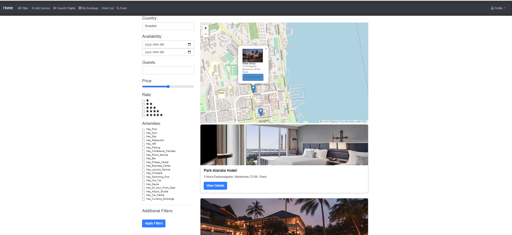
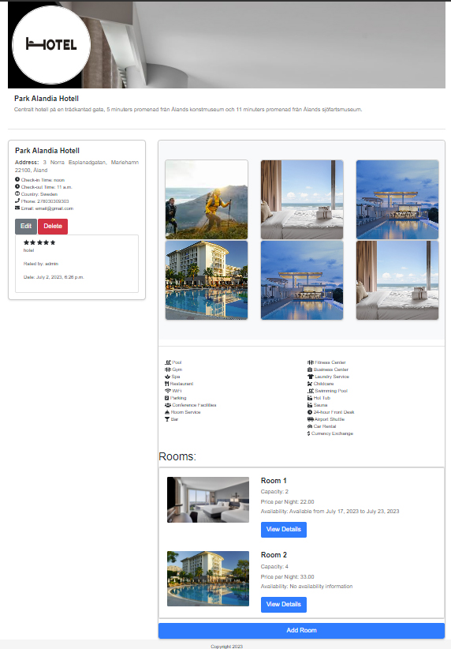

# IRISTRIP

[](https://www.python.org/downloads/)
[](https://www.djangoproject.com/download/)

## Home page
<p align="center"></p>

## Description

IRISTRIP is a web application built with Django that allows users to find and book hotels based on various filters, check room availability, and leave ratings and reviews for the hotels they have visited.
## Hotel View
<p align="center"></p>

## Room View
<p align="center"></p>
## Features

- User Registration and Authentication: Users can sign up, log in, and log out to access the application's features.
- Hotel Listings: Users can view a list of hotels with details, including name, address, amenities, and ratings.
- Hotel Filtering: Users can filter hotels based on criteria such as date, guest count, price range, amenities, and location.
- Hotel Details: Users can view detailed information about a specific hotel, including rooms, availability, and ratings.
- Hotel Ratings: Users can leave ratings and reviews for hotels they have visited.
- Room Booking: Users can book rooms in hotels based on availability and guest count.
- Map View: Hotels are displayed on a map for easy visualization of their locations.
- Admin Panel: An admin panel is available for managing hotels, rooms, bookings, and user ratings.

## Technologies Used

- Python
- Django
- HTML, CSS, JavaScript
- Bootstrap
- Folium (for map integration)
- PostgreSQL (or any other database supported by Django)

Access the application at http://localhost:8000/
## Usage
Start the Django development server using the runserver command.
Visit http://localhost:8000/ in your web browser to access the application.
Use the provided filters and search functionality to find hotels based on your preferences.
View hotel details to see more information about a specific hotel, including available rooms and ratings.
Leave a rating and review for hotels you have visited by using the rating form.
Log in to the admin panel at http://localhost:8000/admin/ to manage hotels, rooms, bookings, and user ratings.
Contributing
Contributions are welcome! If you find any issues or have suggestions for improvements, feel free to create a new issue or submit a pull request.

## License
This project is licensed under the MIT License.

## Installation and Setup

1. Clone the repository:

```bash
git clone https://github.com/yourusername/your-repo-name.git
cd your-repo-name
pip install -r requirements.txt
python manage.py migrate
python manage.py createsuperuser
python manage.py runserver


